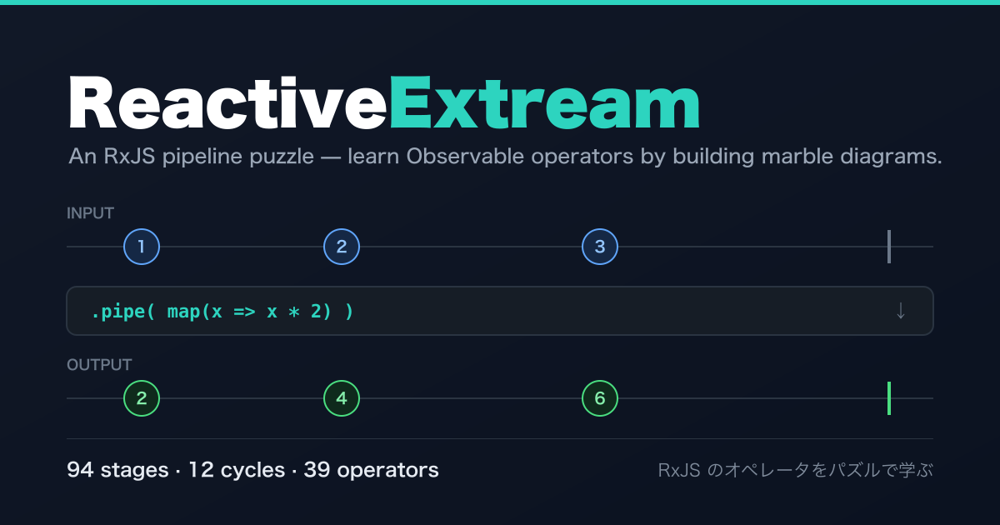

<div align="center">



# ReactiveExtream

**An RxJS / ReactiveX pipeline puzzle — learn Observable operators by building marble diagrams.**

[**▶ Play in the browser**](https://hummer98.dev/rx-pipeline-puzzle/) ・
[日本語 README](README.md) ・
[Contribute a stage](CONTRIBUTING.md)

**94 stages / 12 cycles / 39 operators** ・ No build step ・ Zero dependencies ・ No cookies

[](LICENSE)
[](LICENSE-CONTENT)

</div>

---

## What is this

Marble diagrams are usually something you *read*. ReactiveExtream turns them into something you **build and get graded on**.

1. **Observe** — compare the input stream with the target stream on a timeline.
2. **Build** — chain operators (`map`, `filter`, `debounceTime`, `switchMap`, …) and tune their parameters.
3. **Diff** — the output is recomputed instantly, and every **missing / extra / wrong-value / misplaced-completion** event is colour-coded.

Grading looks only at the output stream, so **alternative solutions pass naturally** (`filter → map` and `map → filter` are both accepted).

When you clear a stage, your pipeline is **generated as real RxJS code**, with a note wherever this game's semantics deliberately differ from the real operator.

There is music and sound too. **Both are on by default** (music starts noticeably quieter than the effects). Mute and the three volume sliders live behind the speaker button in the header, and your settings are remembered.

### Operators (39)

| Cycle | Theme | Operators |
| --- | --- | --- |
| 1 | Basics | `map` `filter` `take` `skip` |
| 2 | State | `scan` `distinctUntilChanged` `takeWhile` `startWith` |
| 3 | Time | `delay` `throttleTime` `debounceTime` `reduce` |
| 4 | Transform | `mapTo` `index` `timestamp` `last` |
| 5 | Position | `takeLast` `skipLast` `elementAt` `defaultIfEmpty` |
| 6 | Selection | `distinct` `takeUntil` `skipUntil` `auditTime` |
| 7 | Joining (2 inputs) | `merge` `zip` `combineLatest` `withLatestFrom` |
| 8 | Control (2 inputs) | `sample` `takeUntil(B)` `skipUntil(B)` `race` |
| 9 | Practice | none new — spec mode: the target stream is hidden until your first run |
| 10 | Branching | none new — you must pre-process stream B before joining |
| 11 | Higher-order | `mergeMap` `concatMap` `switchMap` `exhaustMap` |
| 12 | Errors | `catchError` `retry` `timeout` |

From cycle 7 on, stages are modelled on real-world patterns: type-ahead (`debounceTime` + `distinctUntilChanged`), a save button (`withLatestFrom`), a pricing dashboard (`combineLatest`), drag & drop (`takeUntil(B)` + `scan` + `last`), and so on.

The whole UI is in Japanese, but every operator, parameter and generated code snippet uses its RxJS name, so it is playable if you know RxJS.

## Running it

- Hosted: <https://hummer98.dev/rx-pipeline-puzzle/>
- Locally: clone and open `prototype/index.html` — it works straight from `file://`.

```sh
python3 -m http.server 8000 --directory prototype
```

Progress is kept in `localStorage` and never leaves your browser.

## Deliberate differences from RxJS

- At most **one event per timestamp** per stream (keeps the diff display unambiguous).
- `takeLast` / `skipLast` keep the original timestamps instead of emitting everything at completion.
- Time is **discrete**: `t = 0 .. duration`, events sit on integer ticks.

The full semantics are specified in [`docs/implementation-plan.md`](docs/implementation-plan.md) (in Japanese).

## Analytics & privacy

The public site uses a self-hosted collector (Cloudflare Workers + D1, see [`tools/collector/`](tools/collector/)). It uses **no cookies and no device identifiers, never stores IP addresses** (the User-Agent is reduced to `mobile` / `desktop`), sends only page views and progress milestones — never your input or solutions — honours `Do Not Track` / `Global Privacy Control`, and stays silent on `localhost` and `file://`. Point `endpointUrl` elsewhere, or set `provider: "none"` in `prototype/analytics.js`, and your clone sends nothing at all. See [`docs/metrics.md`](docs/metrics.md).

## License

| Scope | License |
| --- | --- |
| Code (`prototype/*.js`, `*.css`, `*.html`) | [MIT](LICENSE) |
| Stage definitions (`STAGES`), docs, images | [CC BY 4.0](LICENSE-CONTENT) |
| Music & sound effects (`prototype/assets/audio/`) | Not covered — AI-generated, see [NOTICE](prototype/assets/audio/NOTICE.md) |

## Disclaimer

ReactiveExtream is an **unofficial** fan project for learning RxJS. It is not affiliated with, endorsed by, or connected to the ReactiveX / RxJS projects or their maintainers. Operator behaviour is simplified in places for teaching purposes.

“Extream” is a portmanteau of *Extreme* × *Stream*, not a typo.
